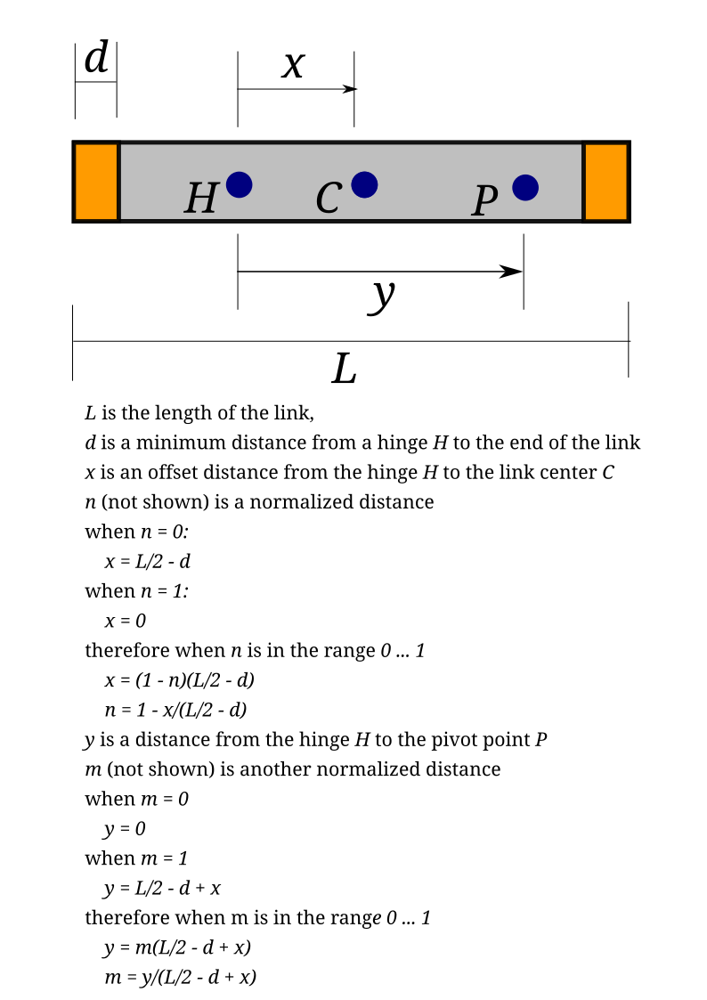

# twolinks
SwiftyTwoLinks and KotlyOtlyDobleDosLinks

## iOS Files and Functionality

- `ContentView.swift` displays the 3D visualization of the double pendulum, and includes user controls
- `ContentViewController.swift` controls the objects used to render in SceneKit, and updates simulation at 1/60 second increments
- `TwoLinks.swift` models the physical behavior of the double pendulum
- `TextSlider.swift` implements a slider control with a text label above it, with semi-transparent background

## Android Files and Functionality

## Calculating Offsets and Pivot Points

There are five normalized values that define dimensions of the two link pendulum system. 
Each link has a length `L`, and a minimum distance `d` from its end where an attachment point can be defined. 
Three points are defined, the hinge point `H` about which the link rotates, the link center point `C`, and a pivot point `P` about which a second link rotates.
The dimension `x` defines the distance from `H` to `C`, and the dimension `y` defines the distance from `H` to `P`.
The diagram below references these dimensions, and explains how they are calculated using normalized values that the user controls.

