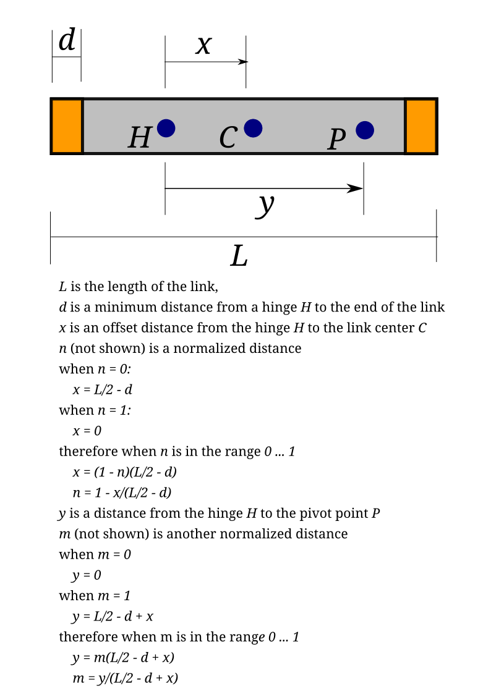

# TwoLinks

A double pendulum simulation built with **Kotlin Compose Multiplatform**, targeting Android, iOS, and Web from a shared codebase.

---

## Architecture

The project lives in `TwoLinksCMP/` and is structured as a single Gradle project with one `composeApp` module and platform-specific source sets.

```
TwoLinksCMP/
├── composeApp/src/
│   ├── commonMain/    — shared Kotlin: models, physics, UI, ViewModel
│   ├── androidMain/   — Android: SceneView (Filament), SceneManager
│   ├── appleMain/     — iOS bridge: UIKitViewController factory
│   ├── iosMain/       — iOS platform impl (Platform.ios.kt, MainViewController)
│   ├── webMain/       — Web: SceneView-Web (Filament.js), SceneManager
│   ├── jsMain/        — JS-specific
│   └── wasmJsMain/    — Wasm/JS-specific
└── iosApp/            — Xcode project
    └── iosApp/
        ├── TwoLinksSceneView.swift    — SwiftUI view, hosts the 3D scene
        ├── SceneManager.swift         — entity building, transforms, planet loading
        ├── iOSApp.swift
        └── Extensions/                — SIMD, Float, Kotlin-math Swift extensions
```

---

## Shared Code (`commonMain`)

| File | Purpose |
|------|---------|
| `model/TwoLinks.kt` | Physics model: state vector, mass matrix, equation of motion, RK4 integration |
| `model/Link.kt` | Single-link data class: geometry, mass, MOI, normalized dimension accessors |
| `model/Planet.kt` | Planet data class: name, scale, position, rotation, fallback color; `file` resolves to `.usdz` on iOS, `.glb` elsewhere |
| `functions/math.kt` | RK4 integrator, 2×2 matrix inverse, Float4 validity checks |
| `functions/paths.kt` | `fileLocation(planet)` and `resolveEnvironmentPath()` path helpers |
| `MainViewModel.kt` | Compose `ViewModel`: state flows, `updateOnFrame`, dimension/color setters, shuffle |
| `TwoLinksSceneView.kt` | `expect` composable, implemented per platform |
| `views/` | Shared UI: `MainBodyScaffold`, `TopAppBar`, `LinkDimensionEditor`, `LinkColorEditor`, `ShuffleDialog`, `PlayAndResetButtons` |

---

## Android (`androidMain`)

Rendering uses **SceneView for Android** (Filament-based).

| File | Purpose |
|------|---------|
| `TwoLinksSceneView.android.kt` | `actual` composable; hosts SceneView with composable node DSL |
| `SceneManager.kt` | Owns Filament `Engine`, `ModelLoader`, `EnvironmentLoader`, camera and sun light nodes, planet `ModelInstance` state |
| `MainActivity.kt` | Entry point |

The scene hierarchy is expressed as composable nodes: `DoorNode` → `PivotNode` + `LinkNode` → `PivotNode` + `LinkNode`. Planet models load asynchronously and are added via `PlanetNode` once their `ModelInstance` is ready.

---

## iOS (`iosApp` + `appleMain`)

Rendering uses **SceneView-Swift** (RealityKit-based).

| File | Purpose |
|------|---------|
| `TwoLinksSceneView.swift` | SwiftUI `View`; owns `SceneManager` and `LightNode`; drives frame updates via `TimelineView(.animation)` |
| `SceneManager.swift` | Builds the RealityKit entity hierarchy (`buildScene`), applies transforms and colors each frame (`applyTransforms`, `applyColors`), loads planets with cross-fade transition |
| `TwoLinksSceneView.apple.kt` | `actual` composable in `appleMain`; embeds a Swift `UIViewController` via `UIKitViewController` |
| `iOSApp.swift` | Registers the scene view controller factory before Compose starts |

Planet loading (`SceneManager.loadPlanet`) shows a colored placeholder sphere immediately, then cross-fades to the USDZ model via `OpacityComponent` and `FromToByAnimation` once the async load completes.

The scene is lit with a warm directional `LightNode` positioned at the sun's world location and aimed at the origin, against a `NightSky` HDR environment.

---

## Web (`webMain`)

Rendering uses **SceneView-Web** (Filament.js via JavaScript interop).

| File | Purpose |
|------|---------|
| `TwoLinksSceneView.web.kt` | `actual` composable; punches a transparent hole through the Skiko canvas so the Filament WebGL scene shows through; drives frame updates via `window.requestAnimationFrame` |
| `SceneManager.kt` | Holds the `HTMLCanvasElement`; initializes the Filament.js scene, environment KTX files, directional light, and planet GLB models |

Transform matrices are computed in Kotlin using `kotlin-math` (`translation`, `rotation`, `scale`) and passed to Filament.js via `@JsFun` external declarations.

---

## Physics

The simulation integrates the equations of motion for a double compound pendulum using **4th-order Runge-Kutta** (RK4).

### Notation

| Symbol | Code | Meaning |
|--------|------|---------|
| $\theta_1, \theta_2$ | `x[0]`, `x[1]` | Absolute angles of link 1 and link 2 |
| $\omega_1, \omega_2$ | `x[2]`, `x[3]` | Angular rates |
| $\alpha_1, \alpha_2$ | `dx[0]`, `dx[1]` | Angular accelerations (solved each step) |
| $m_1, m_2$ | `links[i].mass` | Link masses |
| $I_1, I_2$ | `links[i].moi` | Moments of inertia about each link's own centre of mass |
| $\Delta I_1, \Delta I_2$ | `links[i].moiRelOffset` | Parallel-axis correction: $m_i c_i^2$ |
| $c_1, c_2$ | `links[i].offset` | Distance from hinge to centre of mass along link axis |
| $y$ | `pivot` | Distance from link 1's hinge to the second-link attachment point |
| $g_x, g_y$ | `gx`, `gy` | Gravity components ($g_x = 0$, $g_y = -1.62\ \text{m/s}^2$) |

### State vector

```math
\mathbf{x} = \begin{bmatrix} \theta_1 & \theta_2 & \omega_1 & \omega_2 \end{bmatrix}^\top
```

### Mass matrix

The equation of motion is $\mathbf{M}(\mathbf{x})\,[\alpha_1,\, \alpha_2]^\top = \mathbf{f}(\mathbf{x})$. The 2×2 mass matrix is symmetric:

```math
\mathbf{M}(\mathbf{x}) =
\begin{bmatrix}
  I_1 + \Delta I_1 + m_2 y^2 & m_2\, y\, c_2 \cos(\theta_1 - \theta_2) \\
  m_2\, y\, c_2 \cos(\theta_1 - \theta_2) & I_2 + \Delta I_2
\end{bmatrix}
```

- **M[0,0]** (`m11`) — inertia of the whole system about link 1's hinge, treating link 2 as a point mass at the pivot.
- **M[1,1]** (`m22`) — inertia of link 2 about its own hinge.
- **M[0,1] = M[1,0]** (`m12`) — coupling term; goes to zero when the links are parallel ($\theta_1 = \theta_2$).

### Forcing vector (right-hand side)

General form (with $g_x$ and $g_y$):

```math
\begin{aligned}
f_1 &= -y\, c_2\, m_2\, \omega_2^2 \sin(\theta_1 - \theta_2)
       - y\, g_x\, m_2 \sin\theta_1 + y\, g_y\, m_2 \cos\theta_1
       - c_1 g_x m_1 \sin\theta_1 + c_1 g_y m_1 \cos\theta_1 \\[6pt]
f_2 &= c_2\, m_2 \bigl( y\, \omega_1^2 \sin(\theta_1 - \theta_2) - g_x \sin\theta_2 + g_y \cos\theta_2 \bigr)
\end{aligned}
```

The first terms in each row are Coriolis/centripetal; the remaining terms are gravity acting on each centre of mass. With $g_x = 0$ and $g_y = -g$ (lunar gravity, $g = 1.62\ \text{m/s}^2$) this simplifies to:

```math
\begin{aligned}
f_1 &= -y\, c_2\, m_2\, \omega_2^2 \sin(\theta_1 - \theta_2) - g\,(y\, m_2 + c_1 m_1)\cos\theta_1 \\[6pt]
f_2 &= c_2\, m_2 \bigl( y\, \omega_1^2 \sin(\theta_1 - \theta_2) - g \cos\theta_2 \bigr)
\end{aligned}
```

### Integration

The angular accelerations are recovered by inverting the 2×2 mass matrix analytically (`invert2x2`):

```math
\begin{bmatrix} \alpha_1 \\ \alpha_2 \end{bmatrix} = \mathbf{M}^{-1}(\mathbf{x})\, \mathbf{f}(\mathbf{x})
```

The full state derivative passed to RK4 is:

```math
\dot{\mathbf{x}} = \begin{bmatrix} \omega_1 & \omega_2 & \alpha_1 & \alpha_2 \end{bmatrix}^\top
```

Frame time is capped at 0.1 s before each RK4 step to prevent the integrator from diverging after app suspend/resume. If the resulting state contains NaN or infinity the previous state is kept.

---

## Calculating Offsets and Pivot Points



Five normalized values define the geometry of the two-link system. Each link has a length `L` and an offset `x` — the distance from the hinge point `H` to the link's centre of mass `C`. The first link also exposes a pivot point `P` at distance `y` from `H`, where the second link attaches.

```
          H────────x────────C────────────────────┤
          │◄──── offset ───►│
          │◄──────────── y (pivot) ──────────────►│
          │◄────────────── L/2 + offset ──────────►│
```

- **H** — hinge point (origin of the link's local frame; world origin for link 1)
- **C** — centre of mass, at distance `offset` from H along the link axis
- **P** — pivot for the second link, at distance `pivot` from H (`TwoLinks.pivot`)

### Normalized offset

The user controls `offsetNorm ∈ [0, 1]`, where 0 places H near one end and 1 centres H on the link:

```
offsetNorm = 1 − offset / (L/2 − minDistanceFromEdge)
```

Solving for `offset`:

```
offset = (1 − offsetNorm) × (L/2 − minDistanceFromEdge)
```

`minDistanceFromEdge = 0.03 m` keeps the hinge at least 3 cm from either end.

### Pivot range

The pivot `y` can range from 0 (at the hinge) up to the far end of the link minus the minimum edge clearance:

```
maxPivot = offset + L/2 − minDistanceFromEdge
```

`pivotNorm = pivot / maxPivot` maps linearly to this range. When link 1's length or offset changes, the pivot is clamped to the new `maxPivot` so it never falls outside the link.

### 3D pivot position

`TwoLinks.pivotPosition` returns the pivot in 3D space relative to link 1's hinge:

```kotlin
Float3(pivot, 0f, links[0].thickness)
```

The Z offset by `links[0].thickness` places the second link's hinge flush with the front face of the first link.

